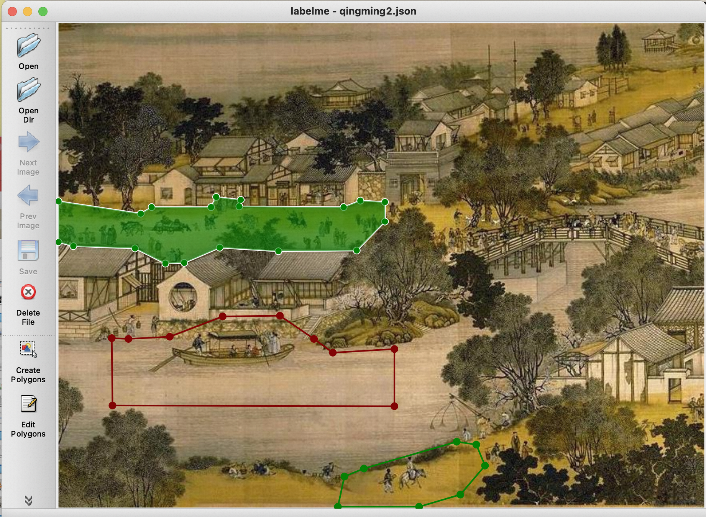
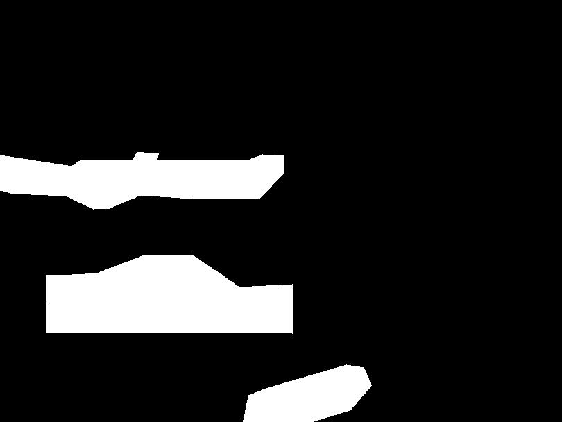
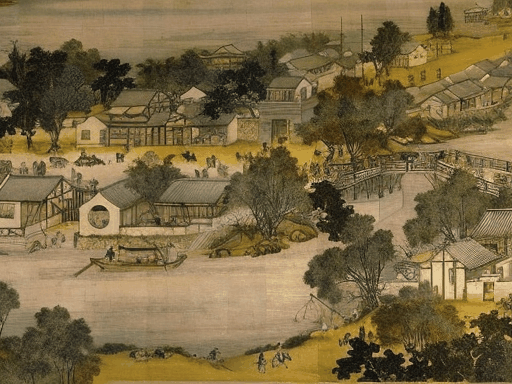

<div align="center">
<h2><center>BioSVD: a Rapid 3D Biomedical Optical Imaging Technique via Stable Video Diffusion</h2>

## Dataset
The data is released on Google Drive(https://drive.google.com/drive/folders/1WyKKeP8n4_DK6SsEitj_RfGv1XBP9tFI?usp=sharing).

## Getting Started
This repository is based on animate-anything(https://github.com/alibaba/animate-anything). You can find more details about Installation and Requirements.

### Create Conda Environment (Optional)
It is recommended to install Anaconda.

**Windows Installation:** https://docs.anaconda.com/anaconda/install/windows/

**Linux Installation:** https://docs.anaconda.com/anaconda/install/linux/

```bash
conda create -n animation python=3.10
conda activate animation
```

### Python Requirements
```bash
pip install -r requirements.txt
```

## Running inference
Please download the [pretrained model](https://cloudbook-public-production.oss-cn-shanghai.aliyuncs.com/animation/animate_anything_512_v1.02.tar) to output/latent, then run the following command. Please replace the {download_model} to your download model name:
```bash
python train.py --config output/latent/{download_model}/config.yaml --eval validation_data.prompt_image=example/barbie2.jpg validation_data.prompt='A cartoon girl is talking.'
```

To control the motion area, we can use the labelme to generate a binary mask. First, we use labelme to draw the polygon for the reference image.



Then we run the following command to transform the labelme json file to a mask.

```bash
labelme_json_to_dataset qingming2.json
```


Then run the following command for inference:
```bash
python train.py --config output/latent/{download_model}/config.yaml --eval validation_data.prompt_image=example/qingming2.jpg validation_data.prompt='Peoples are walking on the street.' validation_data.mask=example/qingming2_label.jpg 
```



User can adjust the motion strength by using the mask motion model:
```bash
python train.py --config output/latent/{download_model}/
config.yaml --eval validation_data.prompt_image=example/qingming2.jpg validation_data.prompt='Peoples are walking on the street.' validation_data.mask=example/qingming2_label.jpg validation_data.strength=5
```

### Configuration

The configuration uses a YAML config borrowed from [Tune-A-Video](https://github.com/showlab/Tune-A-Video) repositories. 

All configuration details are placed in `example/train_mask_motion.yaml`. Each parameter has a definition for what it does.


### Finetuning anymate-anything
You can finetune anymate-anything with text, motion mask, motion strength guidance on your own dataset. The following config requires around 30G GPU RAM. You can reduce the train_batch_size, train_data.width, train_data.height, and n_sample_frames in the config to reduce GPU RAM:
```
python train.py --config example/train_mask_motion.yaml pretrained_model_path=<download_model>
```

## Shoutouts

- [Text-To-Video-Finetuning](https://github.com/ExponentialML/Text-To-Video-Finetuning.git)
- [Showlab](https://github.com/showlab/Tune-A-Video) and bryandlee[https://github.com/bryandlee/Tune-A-Video] for their Tune-A-Video contribution that made this much easier.
- [lucidrains](https://github.com/lucidrains) for their implementations around video diffusion.
- [cloneofsimo](https://github.com/cloneofsimo) for their diffusers implementation of LoRA.
- [kabachuha](https://github.com/kabachuha) for their conversion scripts, training ideas, and webui works.
- [JCBrouwer](https://github.com/JCBrouwer) Inference implementations.
- [sergiobr](https://github.com/sergiobr) Helpful ideas and bug fixes.
